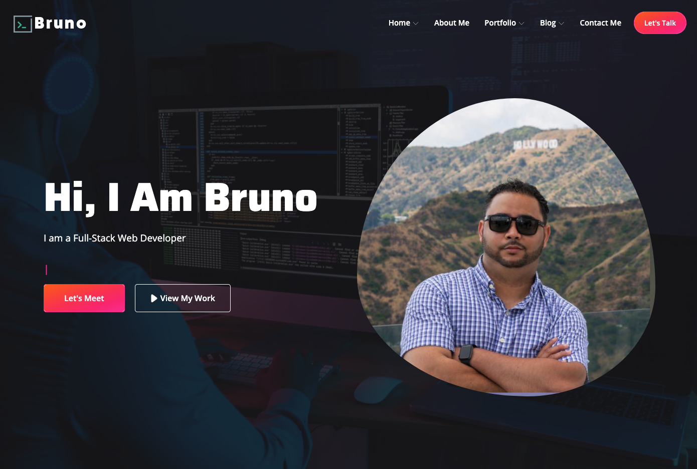

# # Bruno Paula

> Porfolio - Next Js Framework

## Table of contents

- [General info](#general-info)
- [Screenshots](#screenshots)
- [Technologies](#technologies)
- [Setup](#setup)
- [Features](#features)
- [Status](#status)
- [Inspiration](#inspiration)
- [Contact](#contact)

## General info

Latest work
and realizations. Lets work

## Screenshots

## Technologies

- React
- Next
- Adonis

## Setup

next start

## Code Examples

Show examples of usage:
` "scripts": { "dev": "next dev", "build": "next build", "start": "next start" },`

## Features

List of features ready and TODOs for future development

- Axios
- Font Awesome
- Redux

## Status

Project is: _in progress_

## Inspiration

Based on my hard work and long nights studing.

## Contact

Created by [@devbrunopaula](https://www.devbrunopaula/) - feel free to contact me! [devbrunopaula@gmail.com](mailto:devbrunopaula@gmail.com?subject=[GitHub]%20Source%bruno%20Porfolio)
